# Sơ đồ nghiệp vụ

Nguồn Mermaid của trang `so-do-nghiep-vu.html` cùng thư mục (bản HTML có thêm mục đích, phạm vi, ghi chú từng sơ đồ, ma trận quyền ở sơ đồ 9 và bảng ngoại lệ ở sơ đồ 12). Quy tắc nghiệp vụ đầy đủ: `nghiep-vu-da-chot.md`.

## 1a. System Overview: người dùng và hệ thống ngoài

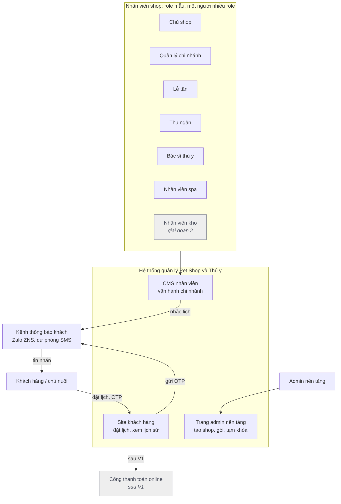
```mermaid
flowchart TB
  subgraph STAFF["Nhân viên shop: role mẫu, một người nhiều role"]
    direction LR
    OW["Chủ shop"]
    BM["Quản lý chi nhánh"]
    RC["Lễ tân"]
    CS["Thu ngân"]
    VT["Bác sĩ thú y"]
    GR["Nhân viên spa"]
    IV["Nhân viên kho<br/><i>giai đoạn 2</i>"]
  end
  subgraph SYS["Hệ thống quản lý Pet Shop và Thú y"]
    direction LR
    CMS["CMS nhân viên<br/>vận hành chi nhánh"]
    SITE["Site khách hàng<br/>đặt lịch, xem lịch sử"]
    ADM["Trang admin nền tảng<br/>tạo shop, gói, tạm khóa"]
  end
  PA["Admin nền tảng"]
  CU["Khách hàng / chủ nuôi"]
  NOTI["Kênh thông báo khách<br/>Zalo ZNS, dự phòng SMS"]
  PAY["Cổng thanh toán online<br/><i>sau V1</i>"]
  STAFF --> CMS
  PA --> ADM
  CU -->|"đặt lịch, OTP"| SITE
  CMS -->|"nhắc lịch"| NOTI
  SITE -->|"gửi OTP"| NOTI
  NOTI -->|"tin nhắn"| CU
  SITE -.->|"sau V1"| PAY
  class IV,PAY later
  classDef later fill:#eeeeee,stroke:#8a8d99,color:#4a4e5c
```

## 1b. System Overview: phân hệ chung/riêng chi nhánh

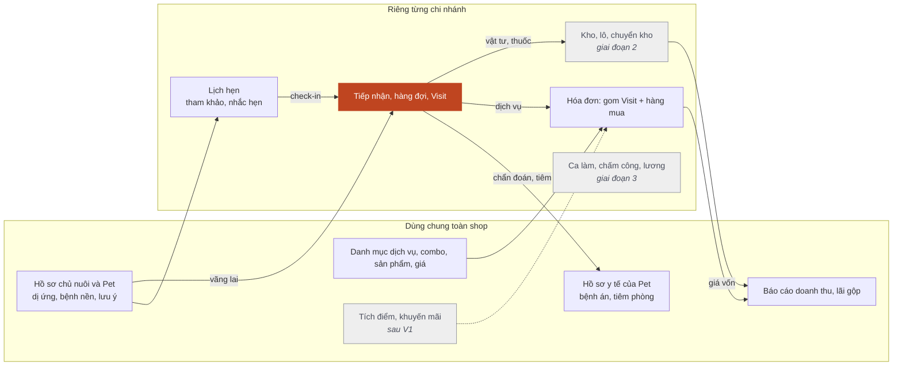
```mermaid
flowchart LR
  subgraph SHOP["Dùng chung toàn shop"]
    direction TB
    C1["Hồ sơ chủ nuôi và Pet<br/>dị ứng, bệnh nền, lưu ý"]
    C2["Hồ sơ y tế của Pet<br/>bệnh án, tiêm phòng"]
    C3["Danh mục dịch vụ, combo, sản phẩm, giá"]
    C4["Tích điểm, khuyến mãi<br/><i>sau V1</i>"]
    C5["Báo cáo doanh thu, lãi gộp"]
  end
  subgraph BRANCH["Riêng từng chi nhánh"]
    direction TB
    B1["Lịch hẹn<br/>tham khảo, nhắc hẹn"]
    B2["Tiếp nhận, hàng đợi, Visit"]
    B3["Hóa đơn: gom Visit + hàng mua"]
    B4["Kho, lô, chuyển kho<br/><i>giai đoạn 2</i>"]
    B5["Ca làm, chấm công, lương<br/><i>giai đoạn 3</i>"]
  end
  C1 --> B1
  B1 -->|"check-in"| B2
  C1 -->|"vãng lai"| B2
  B2 -->|"chẩn đoán, tiêm"| C2
  B2 -->|"dịch vụ"| B3
  B2 -->|"vật tư, thuốc"| B4
  C3 --> B3
  C4 -.-> B3
  B3 --> C5
  B4 -->|"giá vốn"| C5
  class B2 focal
  class C4,B4,B5 later
  classDef focal fill:#bf4520,stroke:#bf4520,color:#ffffff
  classDef later fill:#eeeeee,stroke:#8a8d99,color:#4a4e5c
```

## 2. Customer Journey

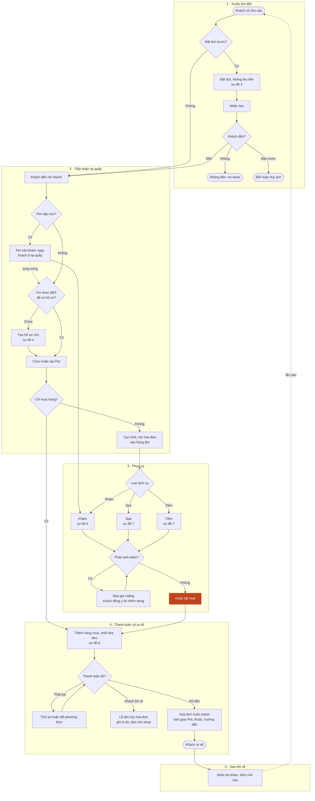
```mermaid
flowchart TD
  subgraph S1["1 · Trước khi đến"]
    A0(["Khách có nhu cầu"])
    A1{"Đặt lịch trước?"}
    A2["Đặt lịch, không thu tiền<br/>sơ đồ 3"]
    A3["Nhắc hẹn"]
    A4{"Khách đến?"}
    X1(["Không đến: no-show"])
    X2(["Đổi hoặc hủy lịch"])
  end
  subgraph S2["2 · Tiếp nhận tại quầy"]
    B0["Khách đến chi nhánh"]
    B1{"Pet cấp cứu?"}
    E1["Pet vào khám ngay<br/>khách ở lại quầy"]
    B2{"Tìm theo SĐT:<br/>đã có hồ sơ?"}
    B3["Tạo hồ sơ chủ<br/>sơ đồ 4"]
    B4["Chọn hoặc tạo Pet"]
    B5{"Chỉ mua hàng?"}
    B8["Tạo Visit, mở hóa đơn<br/>vào hàng đợi"]
  end
  subgraph S3["3 · Phục vụ"]
    C0{"Loại dịch vụ"}
    C1["Khám<br/>sơ đồ 6"]
    C2["Spa<br/>sơ đồ 7"]
    C3["Tiêm<br/>sơ đồ 7"]
    C4{"Phát sinh thêm?"}
    C6["Báo giá miệng<br/>khách đồng ý thì thêm dòng"]
    C7["Hoàn tất Visit"]
  end
  subgraph S4["4 · Thanh toán và ra về"]
    P0["Thêm hàng mua, chốt hóa đơn<br/>sơ đồ 8"]
    P1{"Thanh toán đủ?"}
    P2["Thử lại hoặc đổi phương thức"]
    P4["Lễ tân hủy hóa đơn<br/>ghi lý do, báo chủ shop"]
    H1["Hóa đơn hoàn thành<br/>bàn giao Pet, thuốc, hướng dẫn"]
    H2(["Khách ra về"])
  end
  subgraph S5["5 · Sau khi về"]
    F1["Nhắc tái khám, tiêm mũi sau"]
  end
  A0 --> A1
  A1 -->|"Có"| A2 --> A3 --> A4
  A1 -->|"Không"| B0
  A4 -->|"Không"| X1
  A4 -->|"Báo trước"| X2
  A4 -->|"Đến"| B0
  B0 --> B1
  B1 -->|"Có"| E1
  E1 --> C1
  E1 -.->|"song song"| B2
  B1 -->|"Không"| B2
  B2 -->|"Chưa"| B3 --> B4
  B2 -->|"Có"| B4
  B4 --> B5
  B5 -->|"Có"| P0
  B5 -->|"Không"| B8
  B8 --> C0
  C0 -->|"Khám"| C1
  C0 -->|"Spa"| C2
  C0 -->|"Tiêm"| C3
  C1 --> C4
  C2 --> C4
  C3 --> C4
  C4 -->|"Có"| C6 --> C4
  C4 -->|"Không"| C7
  C7 --> P0 --> P1
  P1 -->|"Thất bại"| P2 --> P1
  P1 -->|"Khách bỏ về"| P4
  P1 -->|"Đủ tiền"| H1
  H1 --> H2 --> F1
  F1 -.->|"lần sau"| A0
  class C7 focal
  classDef focal fill:#bf4520,stroke:#bf4520,color:#ffffff
  classDef open fill:#fbeee7,stroke:#bf4520,stroke-dasharray:5 4,color:#2d3142
  classDef assume fill:#e8eef8,stroke:#3f5f99,stroke-dasharray:2 3,color:#2d3142
```

## 3a. Lịch hẹn: trạng thái

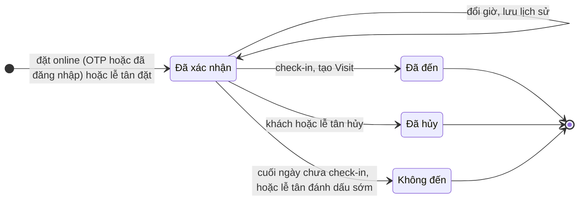
```mermaid
stateDiagram-v2
  direction LR
  [*] --> DaXacNhan: đặt online (OTP hoặc đã đăng nhập) hoặc lễ tân đặt
  DaXacNhan --> DaXacNhan: đổi giờ, lưu lịch sử
  DaXacNhan --> DaHuy: khách hoặc lễ tân hủy
  DaXacNhan --> DaDen: check-in, tạo Visit
  DaXacNhan --> KhongDen: cuối ngày chưa check-in, hoặc lễ tân đánh dấu sớm
  DaDen --> [*]
  DaHuy --> [*]
  KhongDen --> [*]
  DaXacNhan: Đã xác nhận
  DaDen: Đã đến
  DaHuy: Đã hủy
  KhongDen: Không đến
```

## 3b. Lịch hẹn: đặt, đổi, hủy, đến

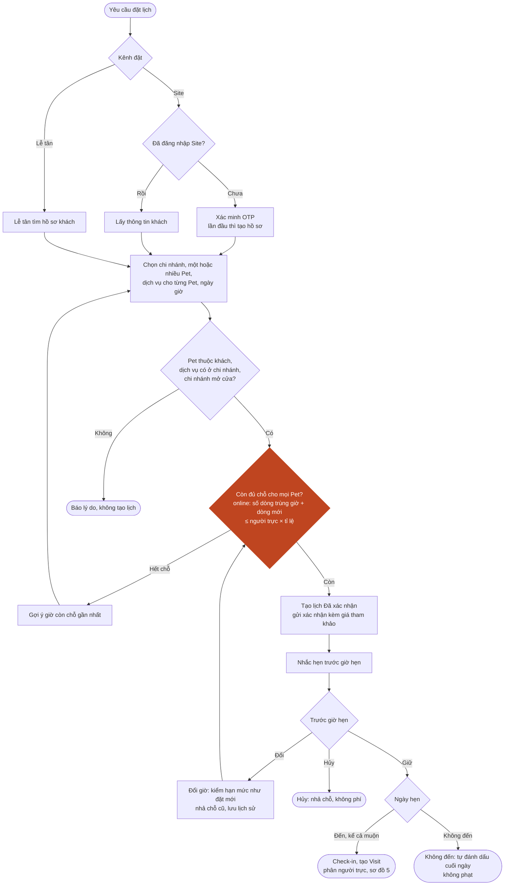
```mermaid
flowchart TD
  R0(["Yêu cầu đặt lịch"])
  R00{"Kênh đặt"}
  RA{"Đã đăng nhập Site?"}
  RB["Xác minh OTP<br/>lần đầu thì tạo hồ sơ"]
  RC["Lấy thông tin khách"]
  RL["Lễ tân tìm hồ sơ khách"]
  R1["Chọn chi nhánh, một hoặc nhiều Pet,<br/>dịch vụ cho từng Pet, ngày giờ"]
  R2{"Pet thuộc khách,<br/>dịch vụ có ở chi nhánh,<br/>chi nhánh mở cửa?"}
  R3{"Còn đủ chỗ cho mọi Pet?<br/>online: số dòng trùng giờ + dòng mới<br/>≤ người trực × tỉ lệ"}
  R5["Gợi ý giờ còn chỗ gần nhất"]
  R6["Tạo lịch Đã xác nhận<br/>gửi xác nhận kèm giá tham khảo"]
  R7["Nhắc hẹn trước giờ hẹn"]
  R8{"Trước giờ hẹn"}
  R9["Đổi giờ: kiểm hạn mức như đặt mới<br/>nhả chỗ cũ, lưu lịch sử"]
  R10(["Hủy: nhả chỗ, không phí"])
  R11{"Ngày hẹn"}
  R12(["Check-in, tạo Visit<br/>phân người trực, sơ đồ 5"])
  R13(["Không đến: tự đánh dấu cuối ngày<br/>không phạt"])
  RX(["Báo lý do, không tạo lịch"])
  R0 --> R00
  R00 -->|"Site"| RA
  RA -->|"Chưa"| RB --> R1
  RA -->|"Rồi"| RC --> R1
  R00 -->|"Lễ tân"| RL --> R1
  R1 --> R2
  R2 -->|"Không"| RX
  R2 -->|"Có"| R3
  R3 -->|"Hết chỗ"| R5 --> R1
  R3 -->|"Còn"| R6 --> R7 --> R8
  R8 -->|"Đổi"| R9 --> R3
  R8 -->|"Hủy"| R10
  R8 -->|"Giữ"| R11
  R11 -->|"Đến, kể cả muộn"| R12
  R11 -->|"Không đến"| R13
  class R3 focal
  classDef focal fill:#bf4520,stroke:#bf4520,color:#ffffff
```

## 4. Khách mới đến trực tiếp

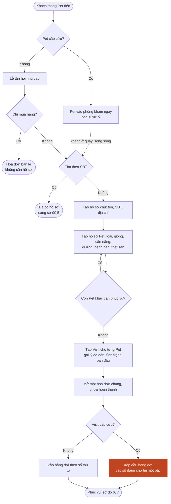
```mermaid
flowchart TD
  N0(["Khách mang Pet đến"])
  N1{"Pet cấp cứu?"}
  N2["Pet vào phòng khám ngay<br/>bác sĩ xử lý"]
  N3["Lễ tân hỏi nhu cầu"]
  N4{"Chỉ mua hàng?"}
  N5(["Hóa đơn bán lẻ<br/>không cần hồ sơ"])
  N6{"Tìm theo SĐT"}
  N7(["Đã có hồ sơ<br/>sang sơ đồ 5"])
  N8["Tạo hồ sơ chủ: tên, SĐT, địa chỉ"]
  N9["Tạo hồ sơ Pet: loài, giống, cân nặng,<br/>dị ứng, bệnh nền, triệt sản"]
  N10{"Còn Pet khác cần phục vụ?"}
  N11["Tạo Visit cho từng Pet<br/>ghi lý do đến, tình trạng ban đầu"]
  N12["Mở một hóa đơn chung, chưa hoàn thành"]
  N13{"Visit cấp cứu?"}
  N14["Xếp đầu hàng đợi<br/>các số đang chờ lùi một bậc"]
  N15["Vào hàng đợi theo số thứ tự"]
  N16(["Phục vụ: sơ đồ 6, 7"])
  N0 --> N1
  N1 -->|"Có"| N2
  N2 -.->|"khách ở quầy, song song"| N6
  N1 -->|"Không"| N3 --> N4
  N4 -->|"Có"| N5
  N4 -->|"Không"| N6
  N6 -->|"Có"| N7
  N6 -->|"Không"| N8 --> N9 --> N10
  N10 -->|"Có"| N9
  N10 -->|"Không"| N11 --> N12 --> N13
  N13 -->|"Có"| N14 --> N16
  N13 -->|"Không"| N15 --> N16
  class N14 focal
  classDef focal fill:#bf4520,stroke:#bf4520,color:#ffffff
  classDef assume fill:#e8eef8,stroke:#3f5f99,stroke-dasharray:2 3,color:#2d3142
```

## 5. Khách đã có hồ sơ

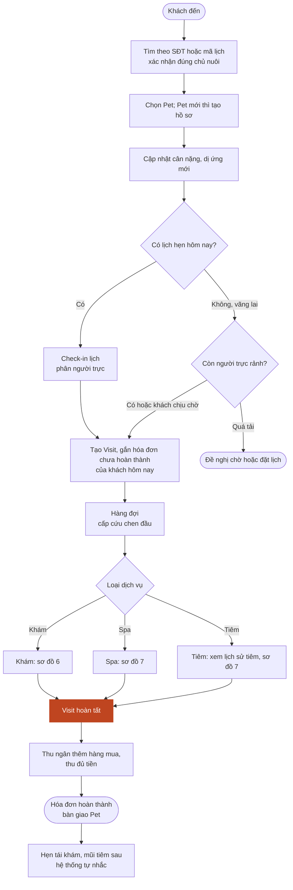
```mermaid
flowchart TD
  E0(["Khách đến"])
  E1["Tìm theo SĐT hoặc mã lịch<br/>xác nhận đúng chủ nuôi"]
  E2["Chọn Pet; Pet mới thì tạo hồ sơ"]
  E3["Cập nhật cân nặng, dị ứng mới"]
  E4{"Có lịch hẹn hôm nay?"}
  E5["Check-in lịch<br/>phân người trực"]
  E6{"Còn người trực rảnh?"}
  E7(["Đề nghị chờ hoặc đặt lịch"])
  E8["Tạo Visit, gắn hóa đơn chưa hoàn thành<br/>của khách hôm nay"]
  E9["Hàng đợi<br/>cấp cứu chen đầu"]
  E10{"Loại dịch vụ"}
  E11["Khám: sơ đồ 6"]
  E12["Spa: sơ đồ 7"]
  E13["Tiêm: xem lịch sử tiêm, sơ đồ 7"]
  E14["Visit hoàn tất"]
  E15["Thu ngân thêm hàng mua,<br/>thu đủ tiền"]
  E16(["Hóa đơn hoàn thành<br/>bàn giao Pet"])
  E17["Hẹn tái khám, mũi tiêm sau<br/>hệ thống tự nhắc"]
  E0 --> E1 --> E2 --> E3 --> E4
  E4 -->|"Có"| E5 --> E8
  E4 -->|"Không, vãng lai"| E6
  E6 -->|"Có hoặc khách chịu chờ"| E8
  E6 -->|"Quá tải"| E7
  E8 --> E9 --> E10
  E10 -->|"Khám"| E11
  E10 -->|"Spa"| E12
  E10 -->|"Tiêm"| E13
  E11 --> E14
  E12 --> E14
  E13 --> E14
  E14 --> E15 --> E16 --> E17
  class E14 focal
  classDef focal fill:#bf4520,stroke:#bf4520,color:#ffffff
  classDef assume fill:#e8eef8,stroke:#3f5f99,stroke-dasharray:2 3,color:#2d3142
```

## 6a. Khám bệnh (theo vai trò)

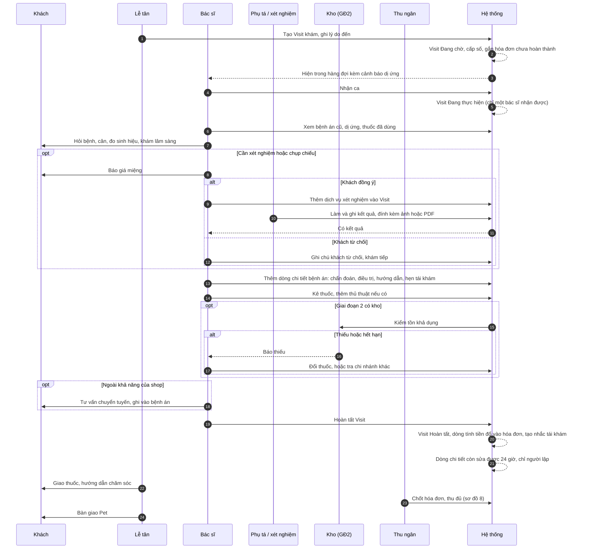
```mermaid
sequenceDiagram
  autonumber
  participant KH as Khách
  participant LT as Lễ tân
  participant BS as Bác sĩ
  participant PT as Phụ tá / xét nghiệm
  participant KHO as Kho (GĐ2)
  participant TN as Thu ngân
  participant HT as Hệ thống
  LT->>HT: Tạo Visit khám, ghi lý do đến
  HT-->>HT: Visit Đang chờ, cấp số, gắn hóa đơn chưa hoàn thành
  HT-->>BS: Hiện trong hàng đợi kèm cảnh báo dị ứng
  BS->>HT: Nhận ca
  HT-->>HT: Visit Đang thực hiện (chỉ một bác sĩ nhận được)
  BS->>HT: Xem bệnh án cũ, dị ứng, thuốc đã dùng
  BS->>KH: Hỏi bệnh, cân, đo sinh hiệu, khám lâm sàng
  opt Cần xét nghiệm hoặc chụp chiếu
    BS->>KH: Báo giá miệng
    alt Khách đồng ý
      BS->>HT: Thêm dịch vụ xét nghiệm vào Visit
      PT->>HT: Làm và ghi kết quả, đính kèm ảnh hoặc PDF
      HT-->>BS: Có kết quả
    else Khách từ chối
      BS->>HT: Ghi chú khách từ chối, khám tiếp
    end
  end
  BS->>HT: Thêm dòng chi tiết bệnh án: chẩn đoán, điều trị, hướng dẫn, hẹn tái khám
  BS->>HT: Kê thuốc, thêm thủ thuật nếu có
  opt Giai đoạn 2 có kho
    HT->>KHO: Kiểm tồn khả dụng
    alt Thiếu hoặc hết hạn
      KHO-->>BS: Báo thiếu
      BS->>HT: Đổi thuốc, hoặc tra chi nhánh khác
    end
  end
  opt Ngoài khả năng của shop
    BS->>KH: Tư vấn chuyển tuyến, ghi vào bệnh án
  end
  BS->>HT: Hoàn tất Visit
  HT-->>HT: Visit Hoàn tất, dòng tính tiền đổ vào hóa đơn, tạo nhắc tái khám
  HT-->>HT: Dòng chi tiết còn sửa được 24 giờ, chỉ người lập
  LT->>KH: Giao thuốc, hướng dẫn chăm sóc
  TN->>HT: Chốt hóa đơn, thu đủ (sơ đồ 8)
  LT->>KH: Bàn giao Pet
```

## 6b. Cấu trúc bệnh án

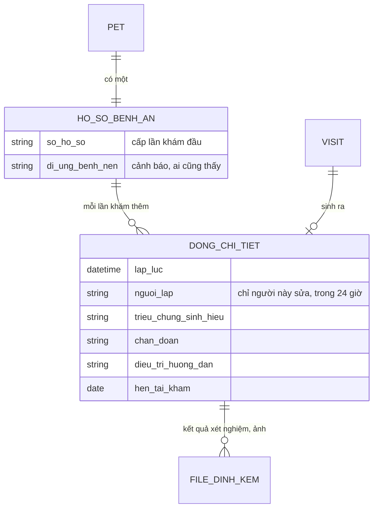
```mermaid
erDiagram
  PET ||--|| HO_SO_BENH_AN : "có một"
  HO_SO_BENH_AN ||--o{ DONG_CHI_TIET : "mỗi lần khám thêm"
  VISIT ||--o| DONG_CHI_TIET : "sinh ra"
  DONG_CHI_TIET ||--o{ FILE_DINH_KEM : "kết quả xét nghiệm, ảnh"
  HO_SO_BENH_AN {
    string so_ho_so "cấp lần khám đầu"
    string di_ung_benh_nen "cảnh báo, ai cũng thấy"
  }
  DONG_CHI_TIET {
    datetime lap_luc
    string nguoi_lap "chỉ người này sửa, trong 24 giờ"
    string trieu_chung_sinh_hieu
    string chan_doan
    string dieu_tri_huong_dan
    date hen_tai_kham
  }
```

## 7a. Spa

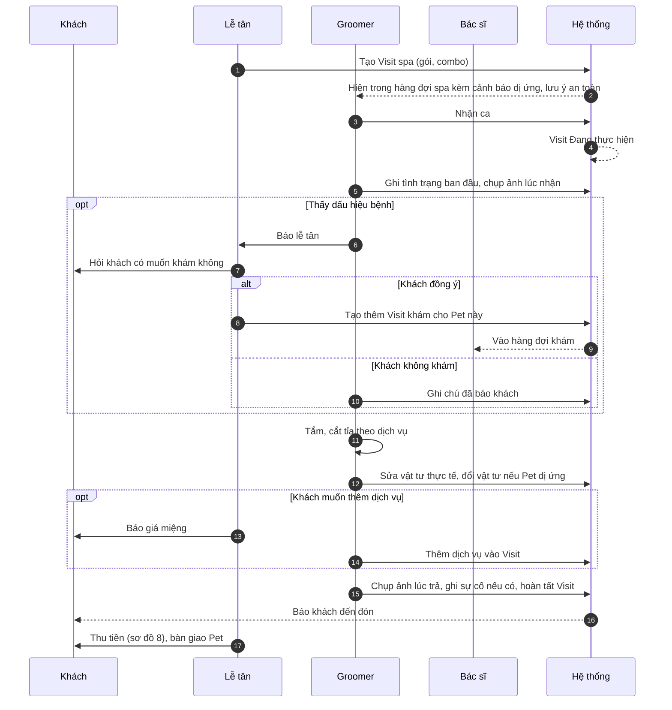
```mermaid
sequenceDiagram
  autonumber
  participant KH as Khách
  participant LT as Lễ tân
  participant GR as Groomer
  participant BS as Bác sĩ
  participant HT as Hệ thống
  LT->>HT: Tạo Visit spa (gói, combo)
  HT-->>GR: Hiện trong hàng đợi spa kèm cảnh báo dị ứng, lưu ý an toàn
  GR->>HT: Nhận ca
  HT-->>HT: Visit Đang thực hiện
  GR->>HT: Ghi tình trạng ban đầu, chụp ảnh lúc nhận
  opt Thấy dấu hiệu bệnh
    GR->>LT: Báo lễ tân
    LT->>KH: Hỏi khách có muốn khám không
    alt Khách đồng ý
      LT->>HT: Tạo thêm Visit khám cho Pet này
      HT-->>BS: Vào hàng đợi khám
    else Khách không khám
      GR->>HT: Ghi chú đã báo khách
    end
  end
  GR->>GR: Tắm, cắt tỉa theo dịch vụ
  GR->>HT: Sửa vật tư thực tế, đổi vật tư nếu Pet dị ứng
  opt Khách muốn thêm dịch vụ
    LT->>KH: Báo giá miệng
    GR->>HT: Thêm dịch vụ vào Visit
  end
  GR->>HT: Chụp ảnh lúc trả, ghi sự cố nếu có, hoàn tất Visit
  HT-->>KH: Báo khách đến đón
  LT->>KH: Thu tiền (sơ đồ 8), bàn giao Pet
```

## 7b. Tiêm phòng

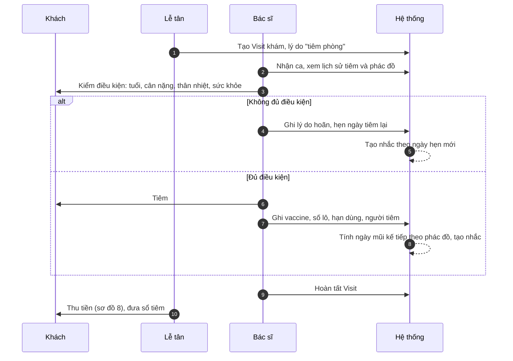
```mermaid
sequenceDiagram
  autonumber
  participant KH as Khách
  participant LT as Lễ tân
  participant BS as Bác sĩ
  participant HT as Hệ thống
  LT->>HT: Tạo Visit khám, lý do "tiêm phòng"
  BS->>HT: Nhận ca, xem lịch sử tiêm và phác đồ
  BS->>KH: Kiểm điều kiện: tuổi, cân nặng, thân nhiệt, sức khỏe
  alt Không đủ điều kiện
    BS->>HT: Ghi lý do hoãn, hẹn ngày tiêm lại
    HT-->>HT: Tạo nhắc theo ngày hẹn mới
  else Đủ điều kiện
    BS->>KH: Tiêm
    BS->>HT: Ghi vaccine, số lô, hạn dùng, người tiêm
    HT-->>HT: Tính ngày mũi kế tiếp theo phác đồ, tạo nhắc
  end
  BS->>HT: Hoàn tất Visit
  LT->>KH: Thu tiền (sơ đồ 8), đưa sổ tiêm
```

## 8a. Hóa đơn: trạng thái

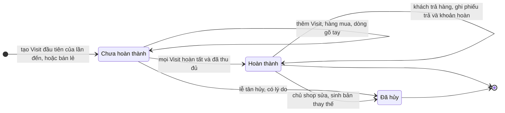
```mermaid
stateDiagram-v2
  direction LR
  [*] --> ChuaHT: tạo Visit đầu tiên của lần đến, hoặc bán lẻ
  ChuaHT --> ChuaHT: thêm Visit, hàng mua, dòng gõ tay
  ChuaHT --> HoanThanh: mọi Visit hoàn tất và đã thu đủ
  ChuaHT --> DaHuy: lễ tân hủy, có lý do
  HoanThanh --> HoanThanh: khách trả hàng, ghi phiếu trả và khoản hoàn
  HoanThanh --> DaHuy: chủ shop sửa, sinh bản thay thế
  HoanThanh --> [*]
  DaHuy --> [*]
  ChuaHT: Chưa hoàn thành
  HoanThanh: Hoàn thành
  DaHuy: Đã hủy
```

## 8b. Chốt và thu tiền

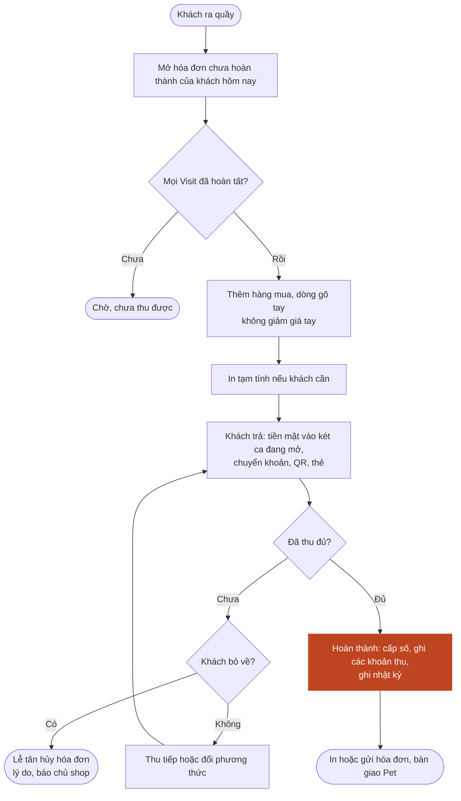
```mermaid
flowchart TD
  T0(["Khách ra quầy"])
  T1["Mở hóa đơn chưa hoàn thành của khách hôm nay"]
  T2{"Mọi Visit đã hoàn tất?"}
  T3(["Chờ, chưa thu được"])
  T4["Thêm hàng mua, dòng gõ tay<br/>không giảm giá tay"]
  T5["In tạm tính nếu khách cần"]
  T6["Khách trả: tiền mặt vào két ca đang mở,<br/>chuyển khoản, QR, thẻ"]
  T7{"Đã thu đủ?"}
  T8["Thu tiếp hoặc đổi phương thức"]
  T9{"Khách bỏ về?"}
  T10(["Lễ tân hủy hóa đơn<br/>lý do, báo chủ shop"])
  T11["Hoàn thành: cấp số, ghi các khoản thu,<br/>ghi nhật ký"]
  T12(["In hoặc gửi hóa đơn, bàn giao Pet"])
  T0 --> T1 --> T2
  T2 -->|"Chưa"| T3
  T2 -->|"Rồi"| T4 --> T5 --> T6 --> T7
  T7 -->|"Chưa"| T9
  T9 -->|"Không"| T8 --> T6
  T9 -->|"Có"| T10
  T7 -->|"Đủ"| T11 --> T12
  class T11 focal
  classDef focal fill:#bf4520,stroke:#bf4520,color:#ffffff
  classDef open fill:#fbeee7,stroke:#bf4520,stroke-dasharray:5 4,color:#2d3142
```

## 8c. Chủ shop sửa hóa đơn đã hoàn thành

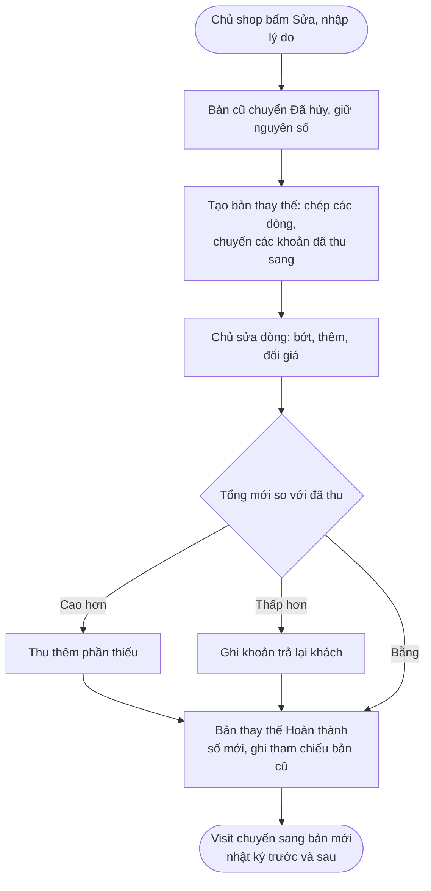
```mermaid
flowchart TD
  O0(["Chủ shop bấm Sửa, nhập lý do"])
  O1["Bản cũ chuyển Đã hủy, giữ nguyên số"]
  O2["Tạo bản thay thế: chép các dòng,<br/>chuyển các khoản đã thu sang"]
  O3["Chủ sửa dòng: bớt, thêm, đổi giá"]
  O4{"Tổng mới so với đã thu"}
  O5["Thu thêm phần thiếu"]
  O6["Ghi khoản trả lại khách"]
  O7["Bản thay thế Hoàn thành<br/>số mới, ghi tham chiếu bản cũ"]
  O8(["Visit chuyển sang bản mới<br/>nhật ký trước và sau"])
  O0 --> O1 --> O2 --> O3 --> O4
  O4 -->|"Cao hơn"| O5 --> O7
  O4 -->|"Thấp hơn"| O6 --> O7
  O4 -->|"Bằng"| O7
  O7 --> O8
  classDef assume fill:#e8eef8,stroke:#3f5f99,stroke-dasharray:2 3,color:#2d3142
  classDef open fill:#fbeee7,stroke:#bf4520,stroke-dasharray:5 4,color:#2d3142
```

## 8d. Khách trả hàng, hoàn tiền

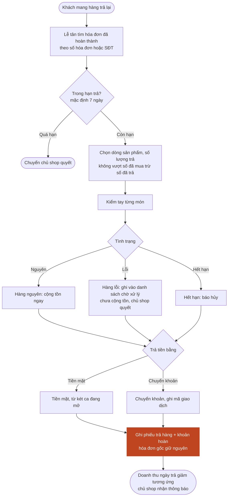
```mermaid
flowchart TD
  H0(["Khách mang hàng trả lại"])
  H1["Lễ tân tìm hóa đơn đã hoàn thành<br/>theo số hóa đơn hoặc SĐT"]
  H2{"Trong hạn trả?<br/>mặc định 7 ngày"}
  H3(["Chuyển chủ shop quyết"])
  H4["Chọn dòng sản phẩm, số lượng trả<br/>không vượt số đã mua trừ số đã trả"]
  H4b["Kiểm tay từng món"]
  H5{"Tình trạng"}
  H6["Hàng nguyên: cộng tồn ngay"]
  H7["Hàng lỗi: ghi vào danh sách chờ xử lý<br/>chưa cộng tồn, chủ shop quyết"]
  H7b["Hết hạn: báo hủy"]
  H8{"Trả tiền bằng"}
  H9["Tiền mặt, từ két ca đang mở"]
  H10["Chuyển khoản, ghi mã giao dịch"]
  H11["Ghi phiếu trả hàng + khoản hoàn<br/>hóa đơn gốc giữ nguyên"]
  H12(["Doanh thu ngày trả giảm tương ứng<br/>chủ shop nhận thông báo"])
  H0 --> H1 --> H2
  H2 -->|"Quá hạn"| H3
  H2 -->|"Còn hạn"| H4 --> H4b --> H5
  H5 -->|"Nguyên"| H6 --> H8
  H5 -->|"Lỗi"| H7 --> H8
  H5 -->|"Hết hạn"| H7b --> H8
  H8 -->|"Tiền mặt"| H9 --> H11
  H8 -->|"Chuyển khoản"| H10 --> H11
  H11 --> H12
  class H11 focal
  classDef focal fill:#bf4520,stroke:#bf4520,color:#ffffff
```

## 8e. Ca thu ngân

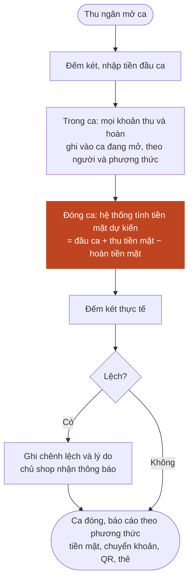
```mermaid
flowchart TD
  K0(["Thu ngân mở ca"])
  K1["Đếm két, nhập tiền đầu ca"]
  K2["Trong ca: mọi khoản thu và hoàn<br/>ghi vào ca đang mở, theo người và phương thức"]
  K3["Đóng ca: hệ thống tính tiền mặt dự kiến<br/>= đầu ca + thu tiền mặt − hoàn tiền mặt"]
  K4["Đếm két thực tế"]
  K5{"Lệch?"}
  K6["Ghi chênh lệch và lý do<br/>chủ shop nhận thông báo"]
  K7(["Ca đóng, báo cáo theo phương thức<br/>tiền mặt, chuyển khoản, QR, thẻ"])
  K0 --> K1 --> K2 --> K3 --> K4 --> K5
  K5 -->|"Có"| K6 --> K7
  K5 -->|"Không"| K7
  class K3 focal
  classDef focal fill:#bf4520,stroke:#bf4520,color:#ffffff
  classDef open fill:#fbeee7,stroke:#bf4520,stroke-dasharray:5 4,color:#2d3142
```

## 10a. Thuộc shop hay thuộc cơ sở

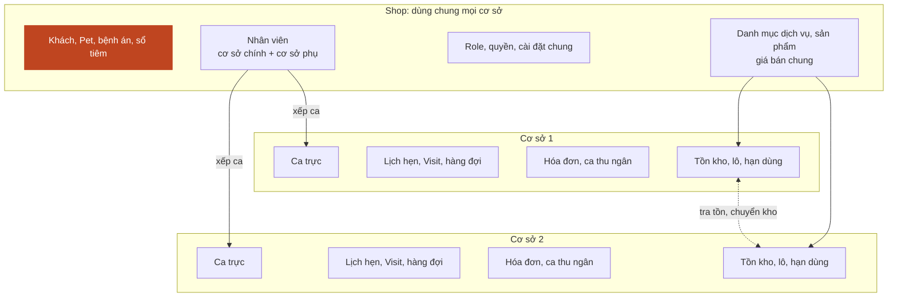
```mermaid
flowchart TB
  subgraph SHOP["Shop: dùng chung mọi cơ sở"]
    direction LR
    S1["Khách, Pet, bệnh án, sổ tiêm"]
    S2["Danh mục dịch vụ, sản phẩm<br/>giá bán chung"]
    S3["Role, quyền, cài đặt chung"]
    S4["Nhân viên<br/>cơ sở chính + cơ sở phụ"]
  end
  subgraph CS1["Cơ sở 1"]
    direction LR
    A1["Ca trực"]
    A2["Lịch hẹn, Visit, hàng đợi"]
    A3["Hóa đơn, ca thu ngân"]
    A4["Tồn kho, lô, hạn dùng"]
  end
  subgraph CS2["Cơ sở 2"]
    direction LR
    B1["Ca trực"]
    B2["Lịch hẹn, Visit, hàng đợi"]
    B3["Hóa đơn, ca thu ngân"]
    B4["Tồn kho, lô, hạn dùng"]
  end
  S4 -->|"xếp ca"| A1
  S4 -->|"xếp ca"| B1
  S2 --> A4
  S2 --> B4
  A4 <-.->|"tra tồn, chuyển kho"| B4
  class S1 focal
  classDef focal fill:#bf4520,stroke:#bf4520,color:#ffffff
```

## 10b. Hết hàng CS1, CS2 còn

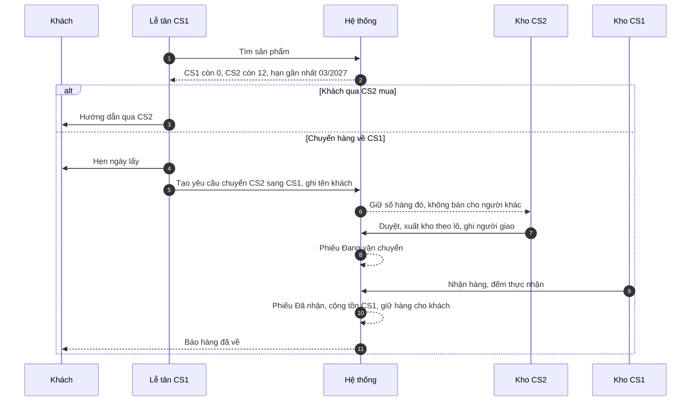
```mermaid
sequenceDiagram
  autonumber
  participant KH as Khách
  participant LT1 as Lễ tân CS1
  participant HT as Hệ thống
  participant K2 as Kho CS2
  participant K1 as Kho CS1
  LT1->>HT: Tìm sản phẩm
  HT-->>LT1: CS1 còn 0, CS2 còn 12, hạn gần nhất 03/2027
  alt Khách qua CS2 mua
    LT1->>KH: Hướng dẫn qua CS2
  else Chuyển hàng về CS1
    LT1->>KH: Hẹn ngày lấy
    LT1->>HT: Tạo yêu cầu chuyển CS2 sang CS1, ghi tên khách
    HT-->>K2: Giữ số hàng đó, không bán cho người khác
    K2->>HT: Duyệt, xuất kho theo lô, ghi người giao
    HT-->>HT: Phiếu Đang vận chuyển
    K1->>HT: Nhận hàng, đếm thực nhận
    HT-->>HT: Phiếu Đã nhận, cộng tồn CS1, giữ hàng cho khách
    HT-->>KH: Báo hàng đã về
  end
```

## 10c. Chấm công nhân viên 2 cơ sở

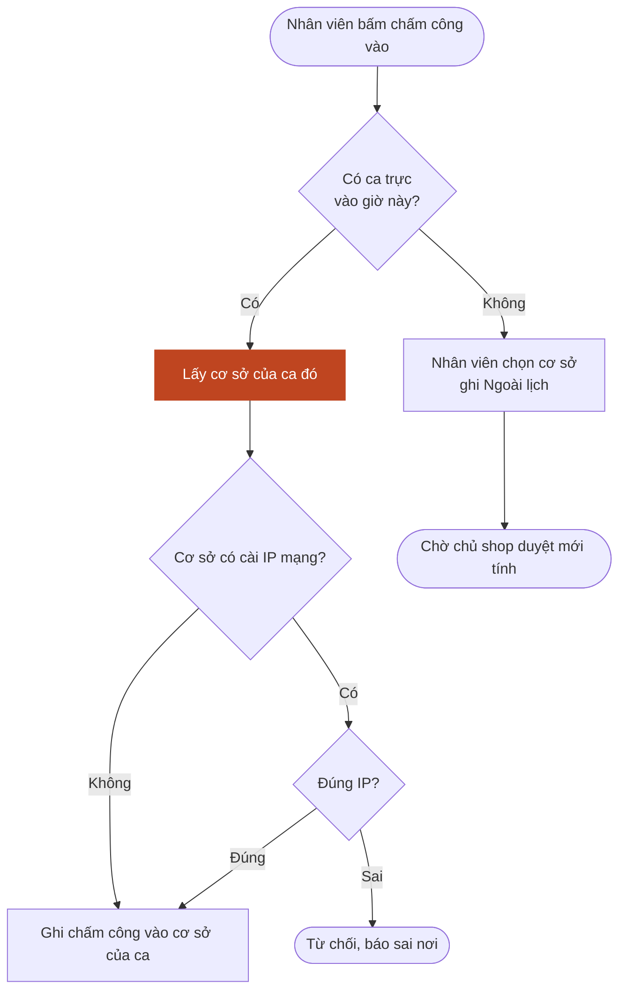
```mermaid
flowchart TD
  C0(["Nhân viên bấm chấm công vào"])
  C1{"Có ca trực<br/>vào giờ này?"}
  C2["Lấy cơ sở của ca đó"]
  C3{"Cơ sở có cài IP mạng?"}
  C4{"Đúng IP?"}
  C5["Ghi chấm công vào cơ sở của ca"]
  C6(["Từ chối, báo sai nơi"])
  C7["Nhân viên chọn cơ sở<br/>ghi Ngoài lịch"]
  C8(["Chờ chủ shop duyệt mới tính"])
  C0 --> C1
  C1 -->|"Có"| C2 --> C3
  C3 -->|"Có"| C4
  C3 -->|"Không"| C5
  C4 -->|"Đúng"| C5
  C4 -->|"Sai"| C6
  C1 -->|"Không"| C7 --> C8
  class C2 focal
  classDef focal fill:#bf4520,stroke:#bf4520,color:#ffffff
```

## 11a. Từ đơn thuốc đến giao thuốc

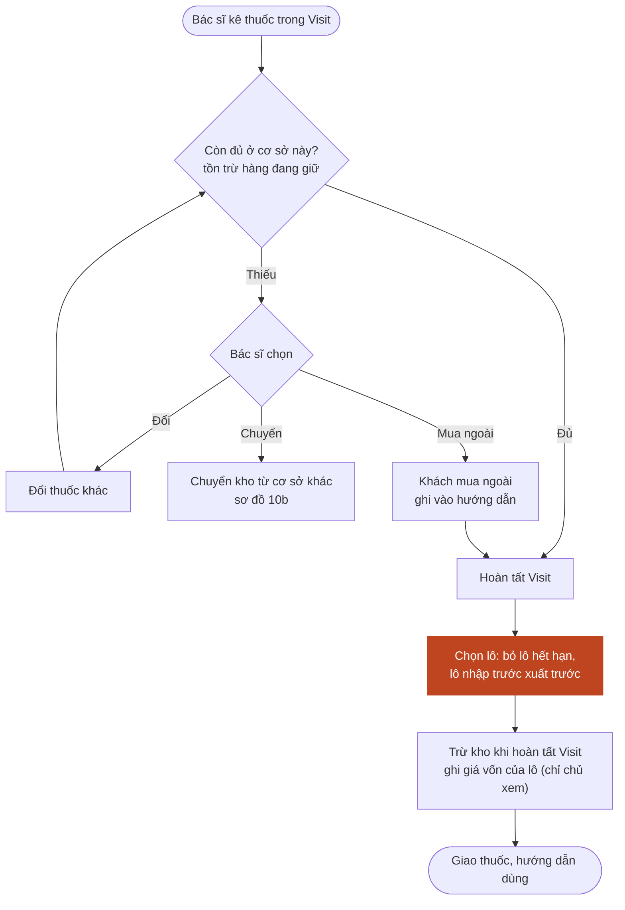
```mermaid
flowchart TD
  P0(["Bác sĩ kê thuốc trong Visit"])
  P1{"Còn đủ ở cơ sở này?<br/>tồn trừ hàng đang giữ"}
  P2{"Bác sĩ chọn"}
  P3["Đổi thuốc khác"]
  P4["Chuyển kho từ cơ sở khác<br/>sơ đồ 10b"]
  P5["Khách mua ngoài<br/>ghi vào hướng dẫn"]
  P6["Hoàn tất Visit"]
  P7["Chọn lô: bỏ lô hết hạn,<br/>lô nhập trước xuất trước"]
  P8["Trừ kho khi hoàn tất Visit<br/>ghi giá vốn của lô (chỉ chủ xem)"]
  P9(["Giao thuốc, hướng dẫn dùng"])
  P0 --> P1
  P1 -->|"Đủ"| P6
  P1 -->|"Thiếu"| P2
  P2 -->|"Đổi"| P3 --> P1
  P2 -->|"Chuyển"| P4
  P2 -->|"Mua ngoài"| P5 --> P6
  P6 --> P7 --> P8 --> P9
  classDef assume fill:#e8eef8,stroke:#3f5f99,stroke-dasharray:2 3,color:#2d3142
  class P7 focal
  classDef focal fill:#bf4520,stroke:#bf4520,color:#ffffff
  classDef open fill:#fbeee7,stroke:#bf4520,stroke-dasharray:5 4,color:#2d3142
```

## 11b. Vòng đời hàng trong kho

```mermaid
flowchart LR
  N0(["Kho lập phiếu nhập<br/>sản phẩm, số lượng, lô, hạn"])
  N1["Chủ điền giá nhập<br/>trên hệ thống của chủ"]
  H["Báo hao hụt<br/>chuột cắn, vỡ; cần duyệt"]
  T["Tồn bán được"]
  O1["Bán trên hóa đơn"]
  O2["Dùng trong Visit<br/>thuốc, vật tư"]
  O3["Chuyển sang cơ sở khác"]
  R0["Khách trả lại<br/>kiểm tay"]
  L["Chờ xử lý: hàng lỗi"]
  X["Hủy hàng<br/>có lý do, cần duyệt"]
  A["Cảnh báo cận hạn, sắp hết"]
  K["Kiểm kê: chênh lệch<br/>có lý do, cần duyệt"]
  N0 --> T
  N0 -.->|"giá"| N1
  T --> H
  T --> O1
  T --> O2
  T --> O3
  R0 -->|"nguyên"| T
  R0 -->|"lỗi"| L
  R0 -->|"hết hạn"| X
  T -->|"hết hạn"| X
  L -->|"chủ chọn: hủy"| X
  L -->|"chủ chọn: bán giảm giá"| S["Mã sản phẩm riêng<br/>giá chủ đặt"]
  T -.-> A
  K -.->|"điều chỉnh"| T
  class T focal
  classDef focal fill:#bf4520,stroke:#bf4520,color:#ffffff
  classDef open fill:#fbeee7,stroke:#bf4520,stroke-dasharray:5 4,color:#2d3142
```

## 12a. Phiếu chuyển kho và đường thất bại

```mermaid
stateDiagram-v2
  direction LR
  [*] --> YeuCau: cơ sở cần hàng tạo
  YeuCau --> DaDuyet: cơ sở gửi duyệt, giữ hàng
  YeuCau --> DaHuy: từ chối hoặc hủy
  DaDuyet --> DangChuyen: xuất kho theo lô
  DaDuyet --> DaHuy: hủy trước khi xuất, nhả hàng giữ
  DangChuyen --> DaNhan: nhận đủ
  DangChuyen --> NhanThieu: nhận thiếu hoặc hỏng
  DangChuyen --> TraVe: hủy giữa đường, hàng quay về
  NhanThieu --> DaNhan: ghi số thực nhận, phần thiếu chờ chủ xử lý
  TraVe --> DaHuy: cơ sở gửi nhập lại
  DaNhan --> [*]
  DaHuy --> [*]
  YeuCau: Yêu cầu
  DaDuyet: Đã duyệt
  DangChuyen: Đang vận chuyển
  DaNhan: Đã nhận
  NhanThieu: Nhận thiếu
  TraVe: Trả về
  DaHuy: Đã hủy
```
